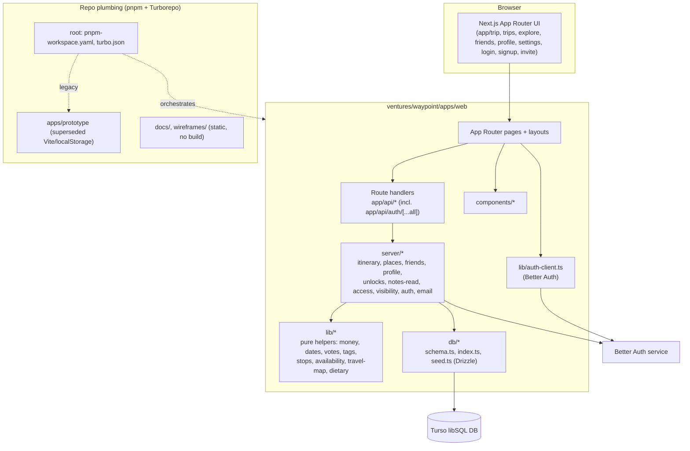
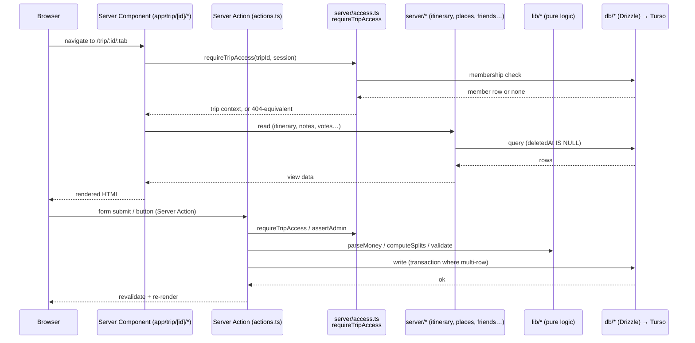
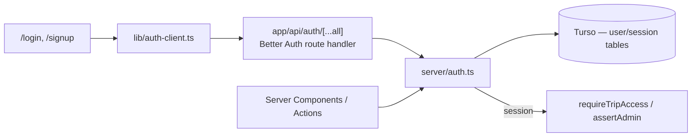
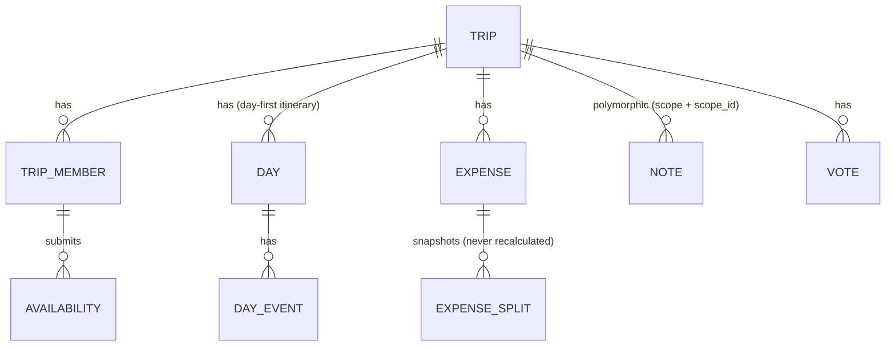

# Architecture

System diagram for the Waypoint monorepo. The active app is
[`ventures/waypoint/apps/web`](../ventures/waypoint/apps/web) — Next.js App
Router + Drizzle over Turso (libSQL) + Better Auth. Everything else in the
repo is plumbing, docs, or superseded prior art.

## Notes

- `lib/` is pure logic (money, dates, tags, votes, availability…); `server/`
  is server-only logic that touches the DB or auth — split per
  [fd49d74](../../fd49d74) (`#107`).
- `apps/prototype` is dead prior art, not wired to anything live — don't
  extend it.
- `docs/`, `wireframe/` are static content, no build step.

## Request flow

Server Components by default; mutations are Server Actions co-located in each
route folder's `actions.ts`. There is **no client-side fetch to our own API** —
`app/api/*` exists only for the Better Auth catch-all
(`app/api/auth/[...all]`), not as a general JSON API.

Key point: **`requireTripAccess` is the only door into a trip.** A non-member
gets the same response as a request for a trip that doesn't exist —
enumeration-proof by construction, never a hand-rolled membership `if`.

## Auth flow

Better Auth owns sessions; `lib/auth-client.ts` is the browser-side handle,
`server/auth.ts` the server-side one. No custom session table, no JWT rolled
by hand.

## Data model shape

Mirrors [`docs/data-model/erd.md`](../ventures/waypoint/docs/data-model/erd.md)
in the venture — that file is the schema of record, kept in lockstep with
`apps/web/src/db/schema.ts`. Shape, not full ERD:

Notes that shape the schema, not just the diagram:

- **No `stop` table.** A "stop" is derived by grouping consecutive `day` rows
  with the same `overnight_place_id` — itinerary storage is day-first.
- **No lifecycle enum.** Trip state is derived from what data exists; the only
  persisted lifecycle bits are sticky unlock flags (`route_unlocked_at`,
  `days_unlocked_at`), which never regress.
- **Money is integer minor units, always** — parsed/split/formatted only
  through `lib/money.ts`, never `parseFloat`. `expense_split` rows are
  write-once snapshots so a member leaving doesn't corrupt history.
- **Soft-delete everywhere** — every read filters `deletedAt IS NULL`.
- **Last-write-wins** — no optimistic locking, no version column;
  `last_modified_at` is debugging-only.
- **Discussion is one polymorphic `note` table** (`scope` + `scope_id`), not a
  comment table per feature.

## Deployment & environments

- **Hosting is per-app, not per-monorepo.** `apps/web` gets its own Vercel
  project + CI workflow; CI must never deploy the whole monorepo at once.
- **Data store:** Turso (libSQL), reached only through `db/index.ts`.
- **Auth:** Better Auth, self-hosted inside the Next.js app (no external auth
  SaaS call at runtime beyond what Better Auth itself makes).
- **Degrade without credentials, never crash** — the pattern repeats at every
  external integration boundary:
  - No Nominatim → fall back to free-text place names.
  - No Resend key → email logged to console instead of sent.
  - No Google client → the button that needs it isn't rendered.
- **Light-only UI**, no theme system — one less environment axis to support.
- Out of scope for v1 (so absent from this architecture on purpose): payment
  rails, POI/attraction data, flight booking, i18n, analytics, push
  notifications.
