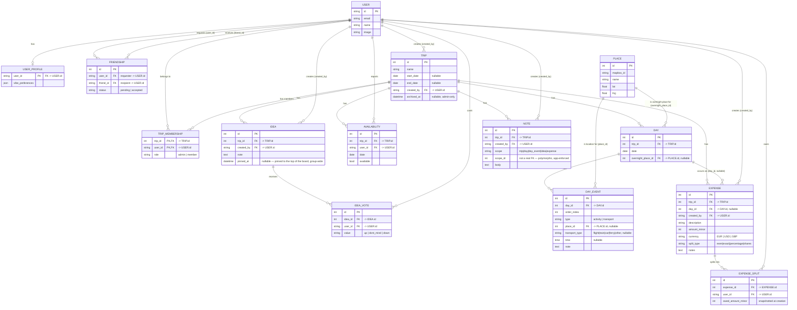

# Waypoint v1 — physical data model

Source of truth for the decisions is
[Core data model and SQLite schema](../../../../.scratch/waypoint-v1/issues/04-core-data-model-and-schema.md).
This diagram is documentation of that decision, not schema code — no
migrations/DDL land until the whole `waypoint-v1` map is walked.

Every table carries `id` (PK), `created_at`, `deleted_at`, `last_modified_at`
— omitted from the entity blocks below to keep them readable; assume all four
on every entity.

`user` / `account` / `session` are Better Auth's own tables, used unmodified
— shown here only as the `user` anchor that our tables extend.

## Relationship cardinalities (plain-English index)

| From | To | Cardinality | Notes |
|---|---|---|---|
| `user` | `user_profile` | 1–0..1 | optional, extends Better Auth's user |
| `user` | `friendship` | 1–M (×2) | one FK as requester, one as recipient |
| `user` | `trip` | 1–M | `trip.created_by` |
| `trip` ↔ `user` | M–M | via `trip_membership` (composite PK) |
| `trip` | `idea` | 1–M | `pinned_at` floats a note above the board's sort (v0.2 ticket 09) |
| `idea` | `idea_vote` | 1–M | one vote per (idea, user) in practice, not DB-enforced |
| `trip` | `availability` | 1–M | one row per (trip, user, date) |
| `trip` | `day` | 1–M | |
| `day` | `day_event` | 1–M | ordered by `order_index` |
| `place` | `day` | 1–M | via `overnight_place_id`, nullable |
| `place` | `day_event` | 1–M | via `place_id`, nullable |
| `trip` | `expense` | 1–M | |
| `day` | `expense` | 1–M | nullable — an expense need not be day-scoped |
| `expense` | `expense_split` | 1–M | |
| `trip` | `note` | 1–M | `scope`/`scope_id` further narrows within the trip |

A **"stop"** (e.g. "3 nights in Rome") is not a table — it's derived by
grouping consecutive `day` rows that share the same `overnight_place_id`.

`note` is the **discussion thread** on anything that has one. In use today for
`scope: "idea"` (why this one, or why not) and `scope: "day_event"` (whatever the
group needs to know about that ferry), read scoped by `(trip_id, scope,
scope_id)` off `note_scope_idx`. One table rather than `idea_comment` +
`day_event_comment` + …: a note is the same object with the same author-or-admin
delete rule wherever it hangs.

`day` deliberately has **no `notes` column**. It had one; nobody could say what
belonged in it, since the thing a group annotates is an event rather than a
whole day. Event details live on `day_event.note`, the conversation in `note`.
