# Waypoint v1 — physical data model

Source of truth for the decisions is
[Core data model and SQLite schema](../../../../.scratch/waypoint-v1/issues/04-core-data-model-and-schema.md).
This diagram is documentation of that decision, not schema code — no
migrations/DDL land until the whole `waypoint-v1` map is walked.

Every table carries `id` (PK), `created_at`, `deleted_at`, `last_modified_at`
— omitted from the entity blocks below to keep them readable; assume all four
on every entity.

`user` / `account` / `session` are Better Auth's own tables, used unmodified
— shown here only as the `user` anchor that our tables extend.

```mermaid
erDiagram
    USER ||--o| USER_PROFILE : "has"
    USER ||--o{ FRIENDSHIP : "requests (user_id)"
    USER ||--o{ FRIENDSHIP : "receives (friend_id)"
    USER ||--o{ TRIP : "creates (created_by)"
    USER ||--o{ TRIP_MEMBERSHIP : "belongs to"
    TRIP ||--o{ TRIP_MEMBERSHIP : "has members"
    TRIP ||--o{ IDEA : "has"
    USER ||--o{ IDEA : "creates (created_by)"
    IDEA ||--o{ IDEA_VOTE : "receives"
    USER ||--o{ IDEA_VOTE : "casts"
    TRIP ||--o{ AVAILABILITY : "has"
    USER ||--o{ AVAILABILITY : "reports"
    TRIP ||--o{ DAY : "has"
    DAY ||--o{ DAY_EVENT : "has"
    PLACE ||--o{ DAY : "is overnight place for (overnight_place_id)"
    PLACE ||--o{ DAY_EVENT : "is location for (place_id)"
    TRIP ||--o{ EXPENSE : "has"
    DAY ||--o{ EXPENSE : "occurs on (day_id, nullable)"
    USER ||--o{ EXPENSE : "creates (created_by)"
    EXPENSE ||--o{ EXPENSE_SPLIT : "splits into"
    USER ||--o{ EXPENSE_SPLIT : "owes"
    TRIP ||--o{ NOTE : "has"
    USER ||--o{ NOTE : "creates (created_by)"
    NOTE ||--o{ NOTE : "replies (parent_id, one level)"
    NOTE ||--o{ NOTE_REACTION : "receives"
    USER ||--o{ NOTE_REACTION : "reacts"
    TRIP ||--o{ NUDGE : "has"
    USER ||--o{ NUDGE : "sends (from_user_id)"
    USER ||--o{ NUDGE : "receives (to_user_id)"

    USER {
        string id PK
        string email
        string name
        string image
    }

    USER_PROFILE {
        string user_id PK "FK -> USER.id"
        string display_name "nullable — our editable copy, not mirrored live"
        string avatar_url "nullable"
        string home_currency "GBP | EUR | USD, default GBP"
        json vibe_preferences "free-form, not structured tags"
        string signup_channel "whatsapp|email|link|direct, nullable"
        bool notify_invites "default true"
        bool notify_votes "default true"
        bool notify_money "default true"
        bool notify_nudges "default true"
    }

    FRIENDSHIP {
        int id PK
        string user_id FK "requester -> USER.id"
        string friend_id FK "recipient -> USER.id"
        string status "pending | accepted"
        string origin "co_trip | request"
    }

    TRIP {
        int id PK
        string name
        date start_date "nullable"
        date end_date "nullable"
        string created_by FK "-> USER.id"
        string invite_token "unguessable, never the trip id"
        string cover_image_url "nullable"
        json tags "nullable, free-text labels, normalised lower-case"
        datetime archived_at "nullable, admin-only"
        datetime route_unlocked_at "nullable, sticky — never regresses"
        datetime days_unlocked_at "nullable, sticky — never regresses"
    }

    TRIP_MEMBERSHIP {
        int trip_id PK,FK "-> TRIP.id"
        string user_id PK,FK "-> USER.id"
        string role "admin | member"
    }

    IDEA {
        int id PK
        int trip_id FK "-> TRIP.id"
        string created_by FK "-> USER.id"
        text note
        datetime pinned_at "nullable — pinned to the top of the board, group-wide"
    }

    IDEA_VOTE {
        int id PK
        int idea_id FK "-> IDEA.id"
        string user_id FK "-> USER.id"
        string value "up | dont_mind | down"
    }

    AVAILABILITY {
        int id PK
        int trip_id FK "-> TRIP.id"
        string user_id FK "-> USER.id"
        date date
        bool available
    }

    DAY {
        int id PK
        int trip_id FK "-> TRIP.id"
        date date
        int overnight_place_id FK "-> PLACE.id, nullable"
    }

    DAY_EVENT {
        int id PK
        int day_id FK "-> DAY.id"
        int order_index
        string type "activity | transport | food — the category Days colours by"
        int place_id FK "-> PLACE.id, nullable"
        string transport_type "flight|train|car|ferry|other, nullable"
        time time "nullable"
        text note
    }

    PLACE {
        int id PK
        string provider_id "nullable — provider-scoped, e.g. osm:relation:65606"
        string name
        float lat "nullable — free-text places have none"
        float lng "nullable"
    }

    EXPENSE {
        int id PK
        int trip_id FK "-> TRIP.id"
        int day_id FK "-> DAY.id, nullable"
        string created_by FK "-> USER.id"
        string paid_by FK "-> USER.id — not always the person who typed it in"
        string description
        int amount_minor
        string currency "EUR | USD | GBP"
        string split_type "even|exact|percentage|shares"
        text notes
    }

    EXPENSE_SPLIT {
        int id PK
        int expense_id FK "-> EXPENSE.id"
        string user_id FK "-> USER.id"
        int owed_amount_minor "snapshotted at creation"
        datetime settled_at "nullable — a claim, v1 moves no money"
    }

    NOTE {
        int id PK
        int trip_id FK "-> TRIP.id"
        string created_by FK "-> USER.id"
        string scope "trip|day|day_event|idea|expense"
        int scope_id "not a real FK — polymorphic, app-enforced"
        int parent_id "-> NOTE.id, nullable — a reply; exactly one level"
        text body
        int edited_at "nullable — set when the author rewrites it"
    }

    NOTE_REACTION {
        int id PK
        int note_id FK "-> NOTE.id"
        string user_id FK "-> USER.id"
        string kind "heart | up | down"
    }

    NUDGE {
        int id PK
        int trip_id FK "-> TRIP.id"
        string from_user_id FK "-> USER.id"
        string to_user_id FK "-> USER.id"
        string tab "ideas|dates|route|days|money — deep-linked in the email"
        text message "nullable"
    }
```

## Relationship cardinalities (plain-English index)

| From | To | Cardinality | Notes |
|---|---|---|---|
| `user` | `user_profile` | 1–0..1 | optional, extends Better Auth's user |
| `user` | `friendship` | 1–M (×2) | one FK as requester, one as recipient |
| `user` | `trip` | 1–M | `trip.created_by` |
| `trip` ↔ `user` | M–M | via `trip_membership` (composite PK) |
| `trip` | `idea` | 1–M | `pinned_at` floats a note above the board's sort (v0.2 ticket 09) |
| `idea` | `idea_vote` | 1–M | one vote per (idea, user) in practice, not DB-enforced |
| `trip` | `availability` | 1–M | one row per (trip, user, date) |
| `trip` | `day` | 1–M | |
| `day` | `day_event` | 1–M | ordered by `order_index` |
| `place` | `day` | 1–M | via `overnight_place_id`, nullable |
| `place` | `day_event` | 1–M | via `place_id`, nullable |
| `trip` | `expense` | 1–M | |
| `day` | `expense` | 1–M | nullable — an expense need not be day-scoped |
| `expense` | `expense_split` | 1–M | |
| `trip` | `note` | 1–M | `scope`/`scope_id` further narrows within the trip |
| `note` | `note` | 1–M | `parent_id` — a comment and its replies, one level only |
| `note` | `note_reaction` | 1–M | at most one live row per (note, person, kind) |
| `trip` | `nudge` | 1–M | peer-to-peer only, no automation |
| `user` | `nudge` | 1–M (×2) | `from_user_id` and `to_user_id` |

A **"stop"** (e.g. "3 nights in Rome") is not a table — it's derived by
grouping consecutive `day` rows that share the same `overnight_place_id`.

**Reordering** therefore writes no order column: there is none, on `day` or
anywhere else. Dragging a stop or a day permutes what the day rows *hold* —
`day.overnight_place_id` and the `day_event` rows' `day_id` — while the dates
stay put (`src/lib/itinerary.ts`). Two consequences fall out of the FKs above:
`expense.day_id` points at a date, so money stays on the day it was spent; and
`note` rows are scoped to `day_event.id`, which doesn't change, so a thread
travels with its event for free.

`note` is the **discussion thread** on anything that has one. In use today for
`scope: "idea"` (why this one, or why not) and `scope: "day_event"` (whatever the
group needs to know about that ferry), read scoped by `(trip_id, scope,
scope_id)` off `note_scope_idx`. One table rather than `idea_comment` +
`day_event_comment` + …: a note is the same object with the same author-or-admin
delete rule wherever it hangs.

`note.parent_id` makes a **reply**, and threads are **exactly one level deep**
(v0.2 ticket 06): `addNote` walks up before inserting, so replying to a reply
attaches to that reply's own parent and the shape can't drift however the UI
changes. Deleting a top-level comment soft-deletes its replies with it — a
reply is only legible under the comment it answers. Unbounded nesting was
rejected on render grounds: Ideas draws its thread in a `max-w-lg` modal, where
a fourth level would be a few words a line.

`note.edited_at` marks a comment its **author** has rewritten, and the UI says
"edited" beside the timestamp. Editing is deliberately **not an admin power**
(rule 6 — admin powers are exactly four): an admin can delete a comment, which
is unambiguous, but never put different words in someone's mouth under their own
name. `last_modified_at` can't stand in for this — it is for debugging only and
moves for reasons the author never chose.

`note_reaction` is the three fixed reactions — heart, thumbs up, thumbs down —
independent of each other, unlike `idea_vote`, which is three-state and
exclusive. Soft-delete means un-reacting revives the same row rather than
inserting a second, so there is **no unique index**; `react` upserts by hand and
every read filters `deleted_at`.

`day` deliberately has **no `notes` column**. It had one; nobody could say what
belonged in it, since the thing a group annotates is an event rather than a
whole day. Event details live on `day_event.note`, the conversation in `note`.
